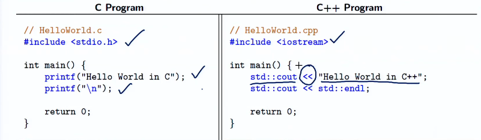

# 
Week One

## Differences in C and C++

> C uses `stdio.h` as the header file for input and output. 
> Meanwhile, C++ uses `iostream` as the header file for input and output.
>
> C uses `printf()` and `scanf()` for input and output.
> Meanwhile, C++ uses `cin` and `cout`, along with the streaming operators `>>` and `<<` for input and output respectively.
>
> 
>
> 
>
> 

## Usage of Header Files

> Header files are used to share information between various source files.
> We define our header file in C/C++ using `#include` preprocessor directive.
>
> So, for example, the `<math.h>` library in C, can be used in C++ by using `#include <cmath>`. It now also falls under the `std` namespace.
>
> C header files can be used in C++ by using the `extern` "c" linkage specification.
>
> **NOTE :** Using `.h` with C++ header files, is disastrous, since these are deprecated. It is dangerous, however most compilers might not show any error.  

## Sorting Algorithms
 
> One of the best sorting algorithms is the Quick Sort algorithm, which is present in C in the `stdlib.h` header file. Using `qsort()` function, we can sort an array in ascending order.
> 
> But in C++, we have the `sort()` function in the `algorithm` header file, which is much more efficient than the `qsort()` function. 