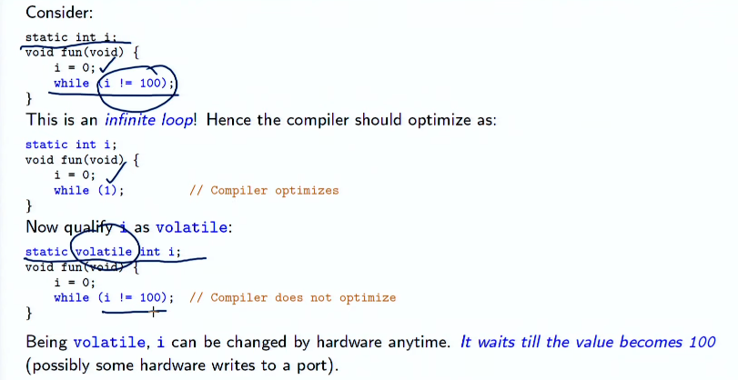
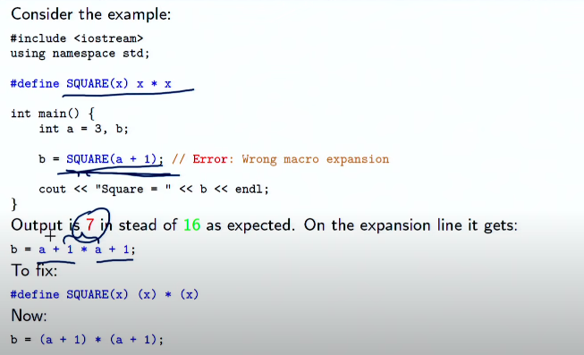
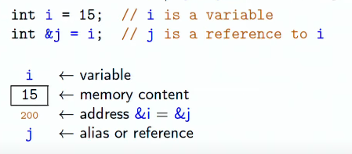
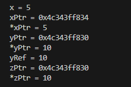
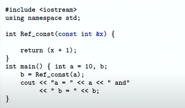
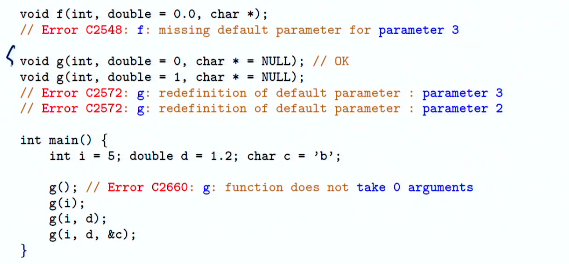
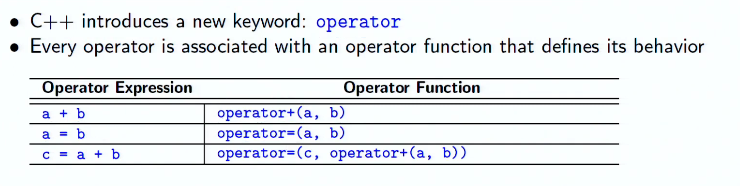
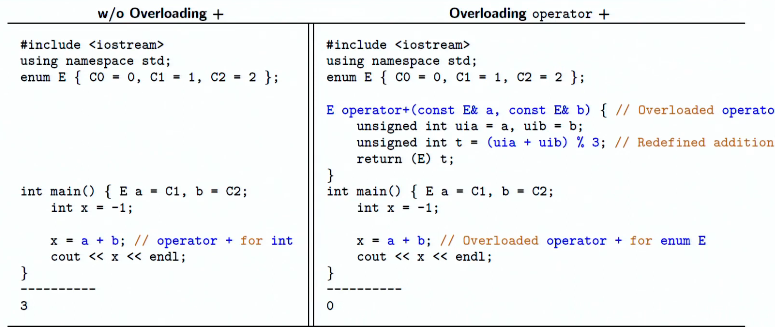
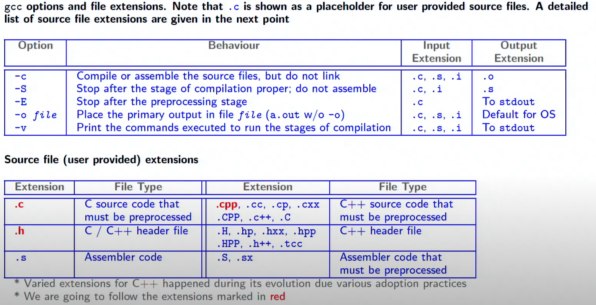

# 
Week Two

## Manifest Constants

> A manifest constant is a name that is defined as a constant and whose value cannot be changed during program execution. 
>
> Manifest constants are defined by `#define`
>
> Value of a `const` cannot be changed after definition. Variable of any type can be declared as `const`.
>
> **NOTE :** `const` is a keyword, while `#define` is a preprocessor directive.

## Differences between constants and manifest constants

> Natural Constants like `pi`, `e`, etc. can be compactly defined and used.
>
> **NOTE :** `NULL` is a manifest constant in C/C++ which is equivalent to 0.

## Why const is preferred over #define
>
> - Manifest constants are `NOT type safe`. Whereas, `const` has a `type`.
>
> - Manifest constants are textually replaced by the CPP Compiler, while constants are visible to the compiler.
>
> - Cannot be `watched` in the debugger, while `const` can be.
>
> - Evaluated as many times as replaced, while `const` is evaluated only once.

## CV-Qualifiers

> - `const` and `volatile` are called CV-Qualifiers.
>
> - `const` is used to specify that a variable is `read-only`.
>
> - `volatile` is used to specify that a variable can be changed by something beyond the control of the program.
>
> Example of `volatile` :
>
> 

## Macros using #define
>
> `#define` is used to define macros.
>
> Macros are much more efficient than functions. They are expanded at compile time.
> 
> Macros are also `textually` replaced by the preprocessor as explained in the slide below.
>
> 

## Inline functions

> `inline` is a keyword used to specify that a function is inline.
>
> Inline functions are expanded at compile time, thus avoiding the overhead of passing parameters between the caller and the callee functions. They are not called at runtime.
>
> It is type safe, and can be debugged.
>
> Inline functions may not be `recursive`. Function body is required for inline-ing at the time of function call. Hence implementation hiding is not possible. **Thus, inline functions should be implemented in header files.**
>
> They can be defined by using : `inline <return_type> <function_name> (<parameters>) { <function_body> }`
>
> **NOTE :** Inline functions increase the size of the code, and if the function is called many times, it is better to expand it at compile time. **However**, if the function is called only once, it is better to call it at runtime.

## References & Pointers

> References are `aliases` for existing variables.
>
> 
>
> In the above image, `j` has the same memory address as `i`. Thus, `j` is an alias for `i`. 
>
> **NOTE :** Pointers, `xPtr`, or `&x` hold memory addresses, while references, `&xRef`, are aliases for existing variables. We can `point` to the contents of a memory location using `*xPtr` or even `*(&xRef)`. 
>
> Click on the image below to see the code for references and pointers.
>
>   
>
> Now, a reference parameter may get changed in the called function. To prevent that, we can use the `const` keyword, as shown in the image below.
>
> 
>
> **NOTE :** When returning a reference, we should **NEVER** return a reference to a local variable. This is because the local variable will be destroyed after the function call, and the reference will be pointing to a garbage value.
>
> In C and C++, arrays are ALWAYS passed by reference.

## Default Parameters & Function Overloading

> Function overloading (also called Static Polymorphism) is the process of using the same function name for different functions. The functions may differ in the number of parameters, or the type of parameters.
>
> Default values are specified while prototyping the function. Default parameters are required while calling functions with fewer arguments or without any argument.
>
> **NOTE :** All parameters to the right of a default argument MUST HAVE default arguments.
>
> 
>
> Functions with the same name must have different number and/or types of formal parameters.
>
> Function selection is performed by the compiler.

## Promotions & Conversions
>
> Objects of an integral type can be converted to another wider integral type, this process is called integral promotion.
>
> C++ promotions are value-preserving, as the value after promotion is guaranteed to be the same as the value before it.
>
> ### **Examples :**
> - `char` to `int`
> - `float` to `double`
> - `enum` to `int` / `short` / `unsigned int`
> - `bool` to `int`
>
> Pointers can also be converted during assignment, initialization and comparison.
>

## Differences between Operators and Functions

### Operators:
> - Written in `infix` notation.
> - Operates n one or more operands.
> - Produces one result.
> - Order of operations are decided by precedence and associativity.
> - Operators are pre-defined.

### Functions:
> - Always written in `prefix` notation.
> - Operates on zero or more operands.
> - May produce one result or none.
> - Order of application is decided by depth of nesting.
> - Functions are user-defined.

## Operator Functions in C++
>
> Operator functions are implicit for predefined operators of built-in types and cannot be redefined.
>
> 
>
> An operator function may have a signature as:
>
> `MyType a, b;` 
> `MyType operator+(MyType, MyType);` <--- This is an operator function.
>
> C++ thus allows users to define an operator function and overload it.

## Operator Overloading

> Also called `ad-hoc polymorphism`, is a specific case of polymorphism, where different operators have different implementations depending on their arguments.
>
> Example for joining strings using `+` operator provided <a href="operatorOverload.cpp">here</a>.
> 
>New semantics for operator+, example given in the image below.
>
> 
>
> For `unary prefix operators`, use: `MyType operator++(MyType& s1);`
>
> For `unary postfix operators`, use: `MyType operator++(MyType& s1, int)`
>

# Dynamic Memory Management

> Dynamic memory management is done using `new` and `delete` operators.
>
> In C, this was done using `malloc()` and `free()` functions.
>
> In C++, `new` keyword is a type. It is similar to `malloc()` in that they allocate memory on heap. Sample code available <a href="memoryManagement.cpp">here</a>.
>
> It also returns a pointer to the allocated memory, of the same type!
>
> `delete` is used to free the memory allocated by `new`. It is the equivalent of `free()` in C.
>
> There are also two functions, `new()` and `delete()`, which are similar to `malloc()` and `free()` respectively. These are **functions**, and not **operators**. Sample code available <a href="memoryManageOperator.cpp">here</a>.
>
> ### Dynamically Managed Arrays
> 
> Allocation using `operator new[]` (different from `operator new`) on heap.
>
> Memory is released by `operator delete[]` (different from `operator delete`) on heap.
>
> Sample code available <a href="dynamicArray.cpp">here</a>.
>
> ### Placement new
>
> Placement new is used to construct an object at a pre-allocated/user-specified memory location.
>
> Sample code available <a href="placementNew.cpp">here</a>.    
>
> **NOTE :** Allocations using the placement new operator **MUST NOT** be deleted.
> 
> Allocation and De-allocation also must correctly match.
> 
> So, do **NOT** free the space created by `new` using `free()`, and vice-versa.
>
> **These errors may result in memory corruption**.

> ### Summary of `gcc` options and File Extensions
>
>  