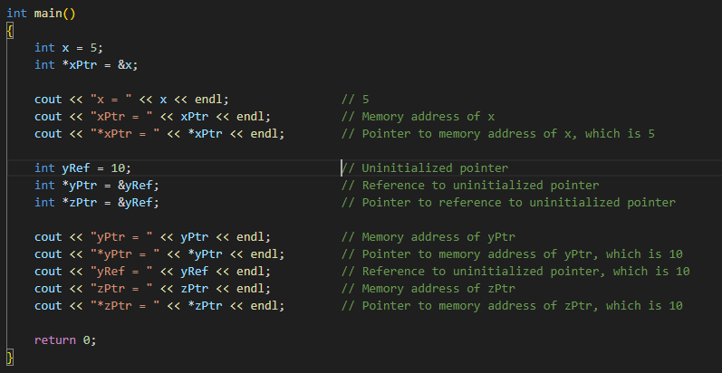

# 
Week Two

## Manifest Constants

> A manifest constant is a name that is defined as a constant and whose value cannot be changed during program execution. 
>
> Manifest constants are defined by `#define`
>
> Value of a `const` cannot be changed after definition. Variable of any type can be declared as `const`.
>
> **NOTE :** `const` is a keyword, while `#define` is a preprocessor directive.

## Differences between constants and manifest constants

> Natural Constants like `pi`, `e`, etc. can be compactly defined and used.
>
> **NOTE :** `NULL` is a manifest constant in C/C++ which is equivalent to 0.

## Why const is preferred over #define
>
> - Manifest constants are `NOT type safe`. Whereas, `const` has a `type`.
>
> - Manifest constants are textually replaced by the CPP Compiler, while constants are visible to the compiler.
>
> - Cannot be `watched` in the debugger, while `const` can be.
>
> - Evaluated as many times as replaced, while `const` is evaluated only once.

## CV-Qualifiers

> - `const` and `volatile` are called CV-Qualifiers.
>
> - `const` is used to specify that a variable is `read-only`.
>
> - `volatile` is used to specify that a variable can be changed by something beyond the control of the program.
>
> Example of `volatile` :
>
> 

## Macros using #define
>
> `#define` is used to define macros.
>
> Macros are much more efficient than functions. They are expanded at compile time.
> 
> Macros are also `textually` replaced by the preprocessor as explained in the slide below.
>
> 

## Inline functions

> `inline` is a keyword used to specify that a function is inline.
>
> Inline functions are expanded at compile time, thus avoiding the overhead of passing parameters between the caller and the callee functions. They are not called at runtime.
>
> It is type safe, and can be debugged.
>
> Inline functions may not be `recursive`. Function body is required for inline-ing at the time of function call. Hence implementation hiding is not possible. **Thus, inline functions should be implemented in header files.**
>
> They can be defined by using : `inline <return_type> <function_name> (<parameters>) { <function_body> }`
>
> **NOTE :** Inline functions increase the size of the code, and if the function is called many times, it is better to expand it at compile time. **However**, if the function is called only once, it is better to call it at runtime.

## References & Pointers

> References are `aliases` for existing variables.
>
> 
>
> In the above image, `j` has the same memory address as `i`. Thus, `j` is an alias for `i`. 
>
> **NOTE :** Pointers, `xPtr`, or `&x` hold memory addresses, while references, `&xRef`, are aliases for existing variables. We can `point` to the contents of a memory location using `*xPtr` or even `*(&xRef)`. 
>
> Click on the image below to see the code for references and pointers.
>
>   
>
>
